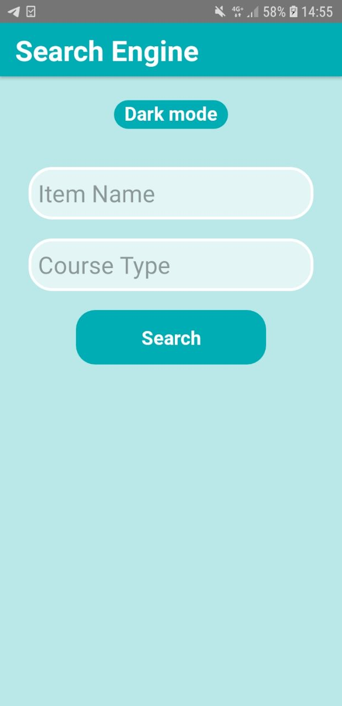
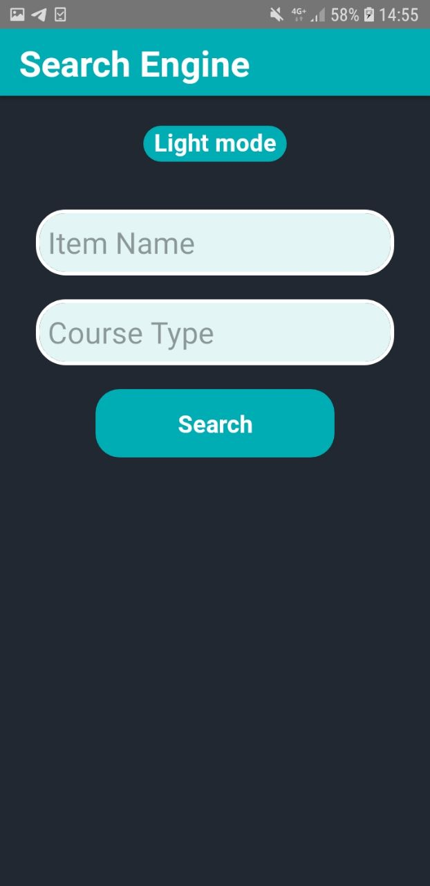
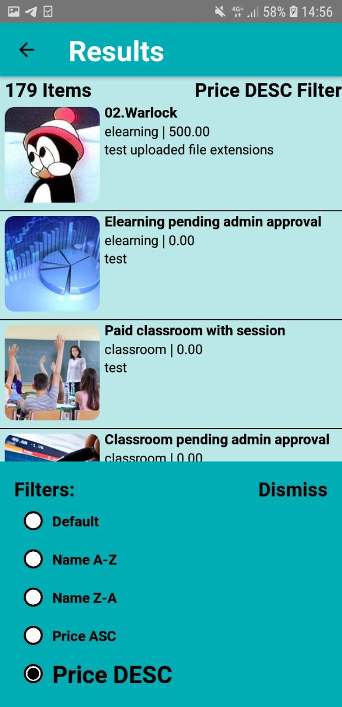
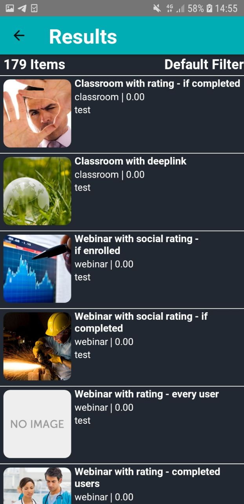
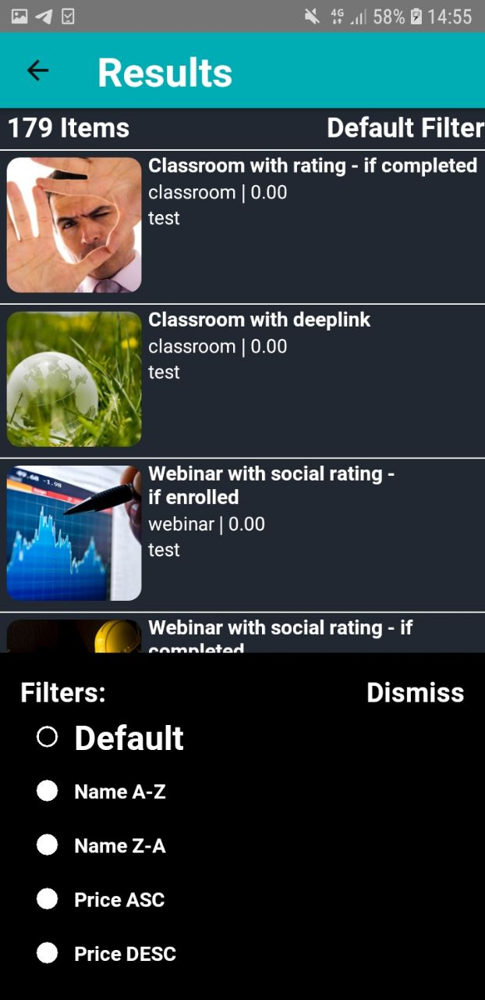

# MDA

The app contains search form where the user can make an availability request with the following parameters:
● Item Name (any string)
● Course Type ("classroom", "elearning", "mobile", "webinar", "learning_plan").Default - all

The form also includes a search button to call the server to retrieve the response and
present the results in a list on another screen with the following informations
● Count of items information (in the title)
● Item thumbnail url (add https protocol) to get image
● Item Name
● Course Type
● Description
● Price

● Lazy loading list
● Button Item: Type sort - show item list ordered by type
● Picker Component: Type filter - show item list filtered by type
● Description plain text - parsing html code to get the plain text only
● Dark/light theme

    
